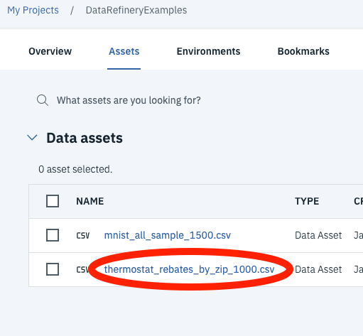
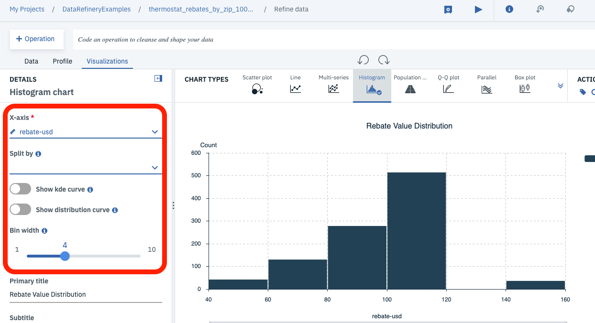
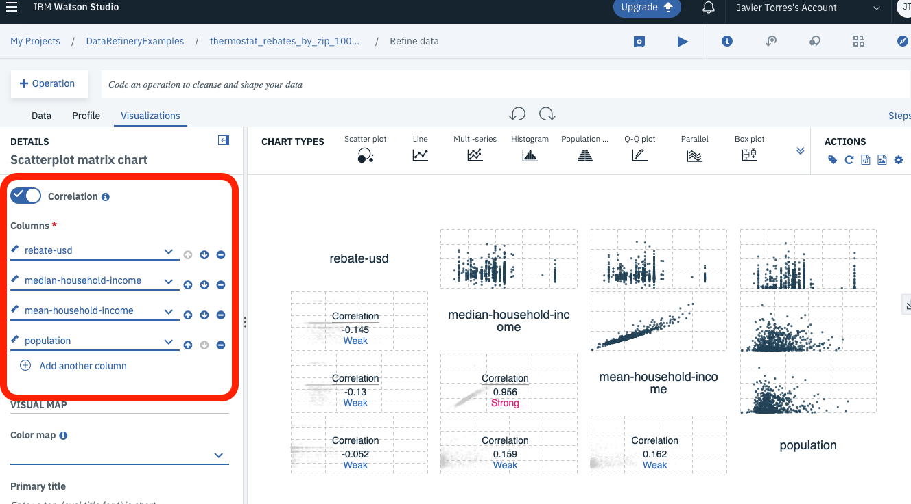
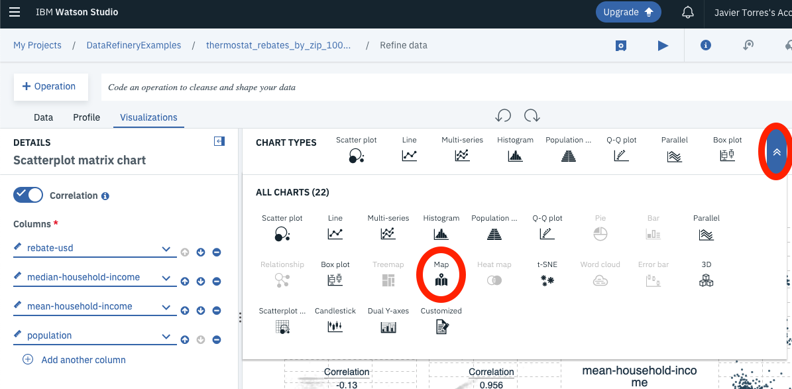
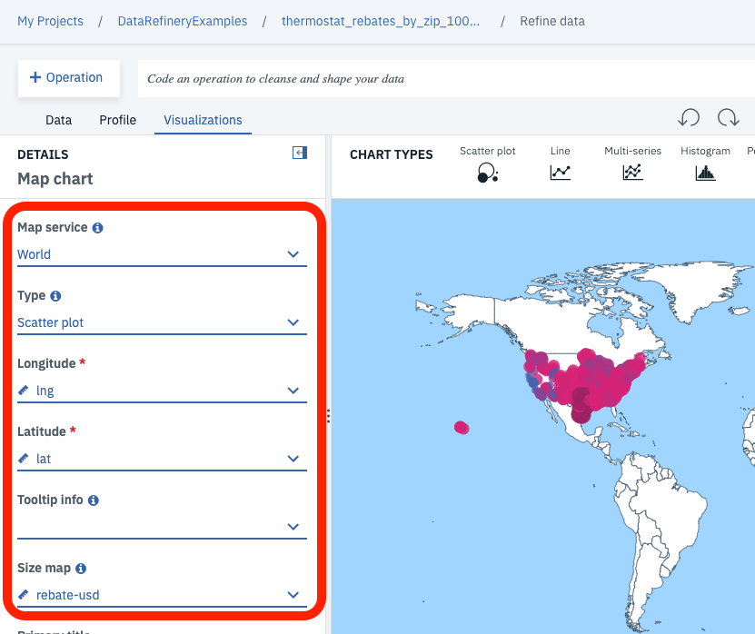

# Data Visualization with Data Refinery in Watson Studio

Credit for the following walkthrough goes to Jorge Castanon, he has created a couple of blogs on using the Data Refinery tool inside Watson Studio to visualize a dataset. Pointers to the original blogs and GitHub repositories are in the Links section below. The goal of this walkthrough is to show how to import a data set into Watson Studio and derive valuable visualizations (i.e charts) without having to write a single line of code.

## Data Refinery Overview

Data Refinery is a self service data preparation component embedded into the IBM Watson Studio and IBM Watson Knowledge Catalog offerings. It allows users to perform or automate the data preparation and cleansing steps in their workflow. Some of the capabilites of Data Refinery include:

* Data Transformation: Shape and clean data using a graphical interfaces or a library of templates populated with powerful data transformation operations using code.
* Data Visualization and Profiling: Understand the quality and distribution of your data using built-in charts, graphs, and statistics. Helps to guide data preparation steps, and reveal data quality issues. Data Refinery will detect the type of data being used and filter to approriate visualizations (i.e a map chart will be suggested for a data set with country names)

## Step 1: Import Data Sets

1. Download the MNIST dataset from this [link](https://ibm.box.com/s/94e4q8askq82owlnr6qxerworm6cx2sp) and save it to your computer.

1. Open Watson Studio by logging in at [https://dataplatform.ibm.com](https://dataplatform.ibm.com) 

1. From the dashboard page, Click the **`Get started`** drop down menu on the top right of the page and then Click on the **`Create a project`** option to create a new project on Watson Studio.

    

1. Select `Standard` as the type of project to create.

1. Give your project a name and click **`Create`** on the bottom right.

    

1. Click the `Assets` tab near the top of the page.

1. Upload the two sample data sets. On the right hand side of the screen, Click the **`browse`** option, then browse to `data` directory of the repository on your local machine (where you cloned or downloaded) and select the `thermostat_rebates_by_zip_1000.csv` file. Then upload the `mnist_all_samples_10000.csv` file from where you saved it in step 1. There is an optional, smaller data set to use for the MNIST example (mnist_all_samples_1500.csv) though the visualizations may not be as detailed..

1. The files should upload with an "Upload Successful" message and then show up under the `Data assets` section of the page. Click the Thermostat data set to see a preview of the data set. Feel free to explore the data.

    

## Step 2: Visualize Data Sets

1. Click the `Refine` blue box in the top right to open the data set with the Data Refinery tool.

    

1. Once the Data Refinery tool is open, there are many options to process and analyze the data set. Click on the **`Profile`** tab to view statistics of the data set.

    

1. Click on the **`Visualizations`** tab, here we can use different chart types to understand the data set (Note that some chart types may be grayed out as they may be not suitable for the data types we have).

1. Click on the **`Histogram`** in the CHART TYPES section.

    

    1. Select "rebate-usd" (thermostat rebates in US dollars) as the `X-axis` value.
    1. Un-select the `Show kde curve` and the `Show distribution curve`
    1. Choose a `Bin width` equal to 4.

        

    1. Notice that you have option on the top right to save the chart image or details.
    1. Feel free to explore a histogram of other values in the data set (i.e income)

1. Click on the **`Scatterplot Matrix`** in the CHART TYPES section. If you receive a "Switch charts?" message just click the `Continue` button. The scatterplot matrix is just multiple scatterplot charts to view pairwise correlations.

    

    1. Select "rebate-usd" (thermostat rebates in US dollars) as the first column value.
    1. Click **`Add another column`** and select column "median-household-income".
    1. Click **`Add another column`** and select column "mean-household-income".
    1. Click **`Add another column`** and select column "population".

        

    1. Notice that the only strong correlation is between "median" and "mean" incomes (similar stastics).

1. Click on the **`Map`** in the CHART TYPES section. If you receive a "Switch charts?" message just click the `Continue` button.

    

    1. Select `World` as the Map Service. If you have a Key to use other mappings services, you can use a different value, the world map is built in.
    1. Select `Scatter plot` as the Type
    1. Select column "lng" as the `Longitude` field
    1. Select column "lat" as the `Latitude` field.
    1. Select column "rebate-usd" (thermostat rebates in USD) as the `Size map` field. 

        

    1. Zoom-in to the interesting areas of the map.

1. Feel free to try other chart types to visualize the thermostat dataset. Some obvious ones might be a box plot where you will see that most rebates are in the 100 USD range with a couple of higher outliers and several lower otuliers.

## Step 3: Visualize High Dimensional Data Sets

1. Next we will visualize a high dimensional data set. For this we will be using the MNIST data set which is a representation of hand written digits. The dataset we are using is a  subset with only 1000 examples of each digit (0 - 9). For a slighter smaller data set, use the mnist_all_sample_1500.csv file instead. The smaller set will load/train quicker but the visualization will have fewer samples.

1. Go back to your main project page by clicking the project name in the top of the page.

    

1. Click the `Assets` tab if you are not already there.

1. In your project, under `Data assets`, click the `mnist_all_sample_10000.csv` data set to see a preview of the data set.

    

1. Given this is a representation of handwritten digit images, each example in the dataset represents one sample image (a 28x28 image), where the columns represent the pixel values (in grayscale) of that image and the final column is a label of the actual digit that is represented.

1. Click the `Refine` blue box in the top right to open the data set with the Data Refinery tool (this step might take a little while).

    

1. Once the Data Refinery tool is open, click on the **`Visualizations`** tab.

1. Select the `t-SNE chart` on the CHART TYPES. t-SNE is well suited for dimensionality reductionn where the relationship between datapoints is non-linear.

    

1. Set the `Perplexity` parameter to 75. Perplexity is determines the number of close neighbors a point/group may have. You can experiment with different values to see at which point you start to see good clusters for the different digits.

1. Select the column "label" as the `Color map`. You can leave the learning rate and total number of iterations as the defaults.

1. The visualization after 1000 iterations should show a colored cloud representing a different digit from zero to nine. It should help you determine where there might be some confusion (i.e. between 7 and 9)

## Links

* [Visualize Data Fast Blog](https://medium.com/inside-machine-learning/visualize-data-fast-watson-studio-ae1ec63e9b8f)
* [Visualize High Dimensional Data Fast Blog](https://medium.com/ibm-watson/visualize-high-dimensional-data-fast-watson-studio-ebad7e7e1b6a)
